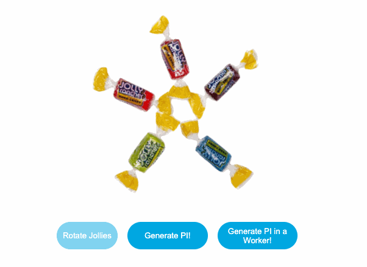
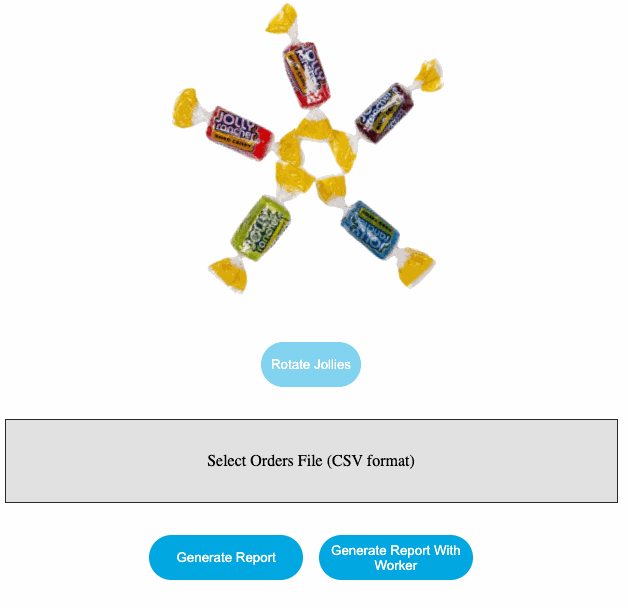
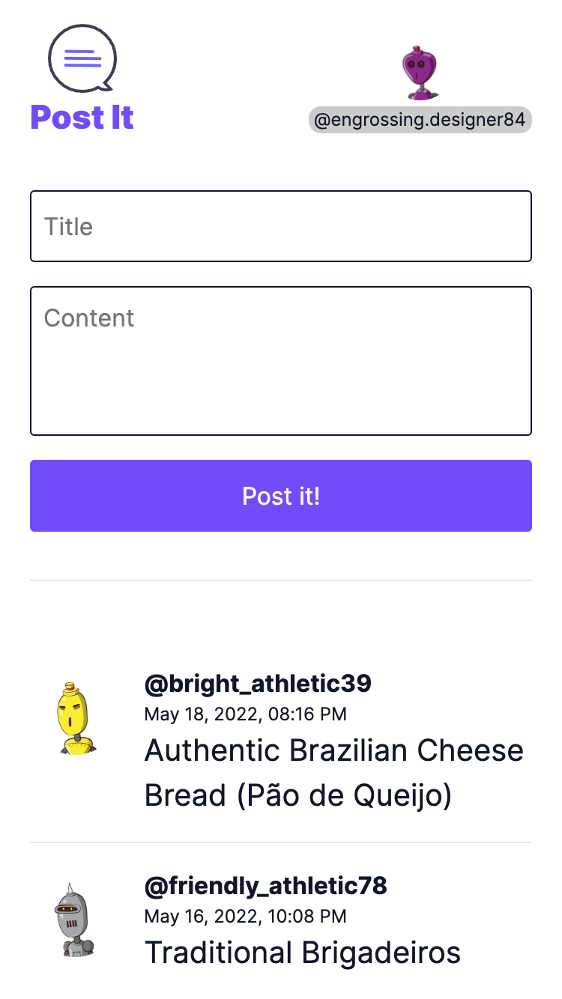

# Progressive Web App Overview

This repository contains the presentation and examples for the "PWA Overview" presented to Ordergroove Engineering Team on May 19th, 2022.

## [00-presentation](./00-presentation)
This folder contains the slides for the presentation. You can access it direct in the browser in this link: [willycamargo.github.io/pwa-presentation-examples/00-presentation/](https://willycamargo.github.io/pwa-presentation-examples/00-presentation/)

## [01-web-workers](./01-web-workers)



This folder contains the first Web Workers example, where we generate PI both in the main thread and in a Web Worker. You can access it direct in the browser by in this link: [willycamargo.github.io/pwa-presentation-examples/01-web-workers/](https://willycamargo.github.io/pwa-presentation-examples/01-web-workers/)

## [02-web-workers](./02-web-workers)



This folder contains the second Web Workers example, where we have an App that generates reports from a large CSV file. You can access it direct in the browser by in this link: [willycamargo.github.io/pwa-presentation-examples/01-web-workers/](https://willycamargo.github.io/pwa-presentation-examples/02-web-workers/)

If you need, there are a list of CSV Files available that you can use to test the application: [02-web-workers/orders-csv/](./02-web-workers/orders-csv/)

## [03-service-workers](./03-service-workers)



This folder contains the App that we used to implement the Web App Manifest and the Service Worker. You can check the commit with the code we did during the presentation here: [084b53d](https://github.com/willycamargo/pwa-presentation-examples/commit/084b53d842ed73099f7a9b1b57c88d15682f02f6)

Unfortunately, this project requires a server to run, so it's not available to be accessed directly via browser. So, you need to run it locally.

### Running 03-service-workers locally

### 1. Requirements
- NodeJS>=16.x
- npm>=8.x

### 2. Clone the project and access the folder
```shell
git clone git@github.com:willycamargo/pwa-presentation-examples.git
cd pwa-presentation-examples/03-service-workers
```

### 3. Install the dependencies
```shell
npm install
```

### 4. Run the development server
```shell
npm run dev
```

## Links mentioned in the presentation
### Docs
- [Progressive Enhancement - MDN](https://developer.mozilla.org/en-US/docs/Glossary/Progressive_Enhancement)
- [Web App Manifest - MDN](https://developer.mozilla.org/en-US/docs/Web/Manifest)
- [Using Web Workers - MDN](https://developer.mozilla.org/en-US/docs/Web/API/Web_Workers_API/Using_web_workers)

### PWA Examples
- [app.starbucks.com](https://app.starbucks.com/)
- [twitter.com](https://twitter.com)
- [pinterest.com](https://pinterest.com)
- [2048game.com](https://2048game.com)

### Web Workers
- [When should you be using Web Workers?](https://surma.dev/things/when-workers)
- [Comlink](https://github.com/GoogleChromeLabs/comlink) - Library that removes the mental barrier of thinking about postMessage and hides the fact that you are working with workers.
- [Partytown](https://github.com/BuilderIO/partytown) - Library that relocate resource intensive third-party scripts off of the main thread and into a web worker.
- [neo.mjs](https://github.com/neomjs/neo) - Web Worker driven frontend framework to create multithreaded Web Apps

### Service Workers
- [Progressive Web Apps in 100 Seconds](https://www.youtube.com/watch?v=sFsRylCQblw) - Youtube Video by Fireship
- [serviceworke.rs](https://serviceworke.rs) - A collection of working, practical examples of using service workers in modern web sites.
- [workbox](https://developer.chrome.com/docs/workbox) - Production-ready service worker libraries and tooling
- [pwabuilder.com](https://pwabuilder.com/) - Tool to help building and publishing PWAs
